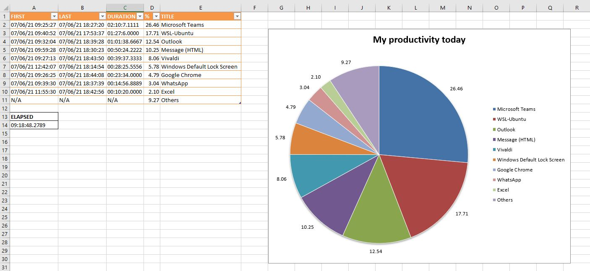

# MPDK

**M**y **P**roductivity **D**on't **K**eel

This is my simple tool to monitor active windows and summarize your activities during the day.

### Install

```bash
pip.exe install -r requirements.txt
```

### Configuration
- config.py

### Run

```bash
python.exe main.py
```


### Result

```terminal
===== SUMMARY =====

+--------------------------+--------------------------+-------+-------+-----------------------------+
|          FIRST           |           LAST           | COUNT |   %   |            TITLE            |
+--------------------------+--------------------------+-------+-------+-----------------------------+
| Tue Jun  1 08:45:20 2021 | Tue Jun  1 17:51:19 2021 | 72723 | 48.14 |       Microsoft Teams       |
| Tue Jun  1 08:41:07 2021 | Tue Jun  1 17:52:54 2021 | 32565 | 21.56 |          WSL-Ubuntu         |
| Tue Jun  1 08:41:10 2021 | Tue Jun  1 17:51:27 2021 | 10712 |  7.09 |           Outlook           |
| Tue Jun  1 09:04:44 2021 | Tue Jun  1 17:51:39 2021 |  5867 |  3.88 |           WhatsApp          |
| Tue Jun  1 08:53:38 2021 | Tue Jun  1 17:51:45 2021 |  4976 |  3.29 |        Google Chrome        |
| Tue Jun  1 14:39:42 2021 | Tue Jun  1 17:21:03 2021 |  4552 |  3.01 |        Desktop Viewer       |
| Tue Jun  1 13:36:12 2021 | Tue Jun  1 14:28:53 2021 |  4470 |  2.96 | Windows Default Lock Screen |
+--------------------------+--------------------------+-------+-------+-----------------------------+
>>> Elapsed time 09:11:46.7201
```

### Chart (manually created)


